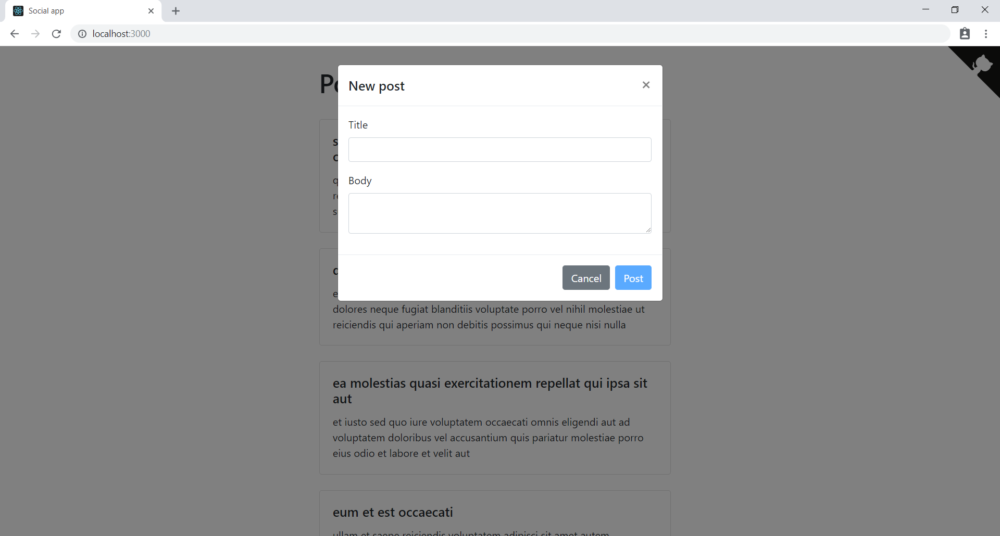

# Social app

This is an example project that shows useful approaches and techniques to write React+Redux applications.
The application uses [JSONPlaceholder service](https://jsonplaceholder.typicode.com/) as a fake REST API.



## Getting Started

Install dependencies:

```
yarn install
```

## Running the application

Run the application:

```
yarn start
```

Open [http://localhost:3000](http://localhost:3000) in your browser to view the result.
